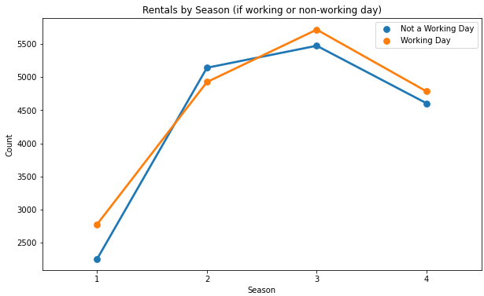
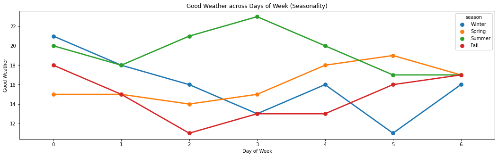
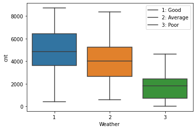
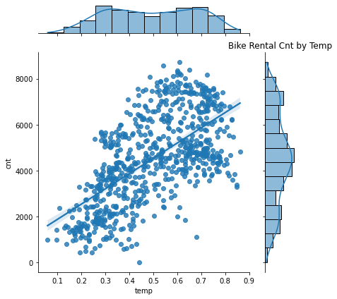
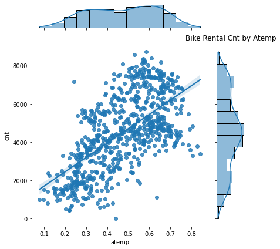

# Bike Share Demand - Project 3


**Author**: Annie Liu

## Overview

City Transport Services (CTS) wish to better understand mobility in the city, in particular the bike sharing systems and the characteristics of the data generated by these systems. Hence, it is expected that most of the important events in the city could be detected via monitoring these data. By better understanding this data, CTS wish to be able to better forecast mobility and plan for future events. This project analyses various attributes associated to daily bike rentals. Specifically, we assessed seasonality, weather conditions and types of users. 
From this, we put forward the following recommendations to CTS to consider when planning for events:

* Bike rentals are highest during warmer season (Spring and Summer), therefore could reduce frequency or supply of other transport services (such as buses, trains etc). Bike rentals are lowest during Winter, and therefore CTS could consider providing more transport means. 

* Rentals seem to be highest during 'good' weather conditions (Clear with few clouds) , and drops roughly 50% during 'poor' weather (light snow, light ran + thunderstorm + scattered clouds, light rain + scattered clouds). Therefore ensuring more available transport means during 'poor' weather conditions (and vice versa). Assessing weather forecast conditions will assist for planning.

* Temp and atemp have a high corrleation with bike rental counts, CTS could assess climate data from previous years to predict temp and bike rental demand for the future. Similarly, to the above proposed, more transport options available during cold days (and vice versa).
 

## Business Problem

Due to CTS having limited knowledge of bike rental demand, we ask the following questions to help us solve the business problem.

***
Questions considered:
* What are the business's pain points related to this project?

CTS have limited knowledge of bike rental demand in the city. We assessed various attributes in particular season, weathersit and temp/atemp to aid us in solving this.

* How did you pick the data analysis question(s) that you did?

Season, weathersit and temp/atemp all seem like reasonable factors that could impact volume of bike rentals.

* Why are these questions important from a business perspective?

By answering these questions, CTS can make better assumptions on how to control transport means and resources, when to supply more or less and how to efficently run operations within the city transport network.
***

## Data

One dataset 'day.csv' which includes the record index of all bike rentals between 2011-2012 and the attributes, was used for this analysis.

***

We targeted the following variables; season (1: winter, 2: spring, 3: summer, 4: fall), weathersit (1: Clear, Few clouds, Partly cloudy, Partly cloudy, 2: Mist + Cloudy, Mist + Broken clouds, Mist + Few clouds, Mist, 3: Light Snow, Light Rain + Thunderstorm + Scattered clouds, Light Rain + Scattered clouds, 4: Heavy Rain + Ice Pallets + Thunderstorm + Mist, Snow + Fog), temp (normalised temp in celscius), atemp (normalised feeling temperature in celscius) and cnt (count of total rental bikes including both casual and registered).

***

## Methods

Preparation, analysis and modelling the data. 
Cross correlation, visualization, feature engineering, train/test data, assumptions of linearity, 27 OLS Regression models, prediction using model 29.

***

Dataset was imported, 'dteday' coverted to Date time, followed by 'mnth' with names of month. Data had no duplicates or null values. We were able to immediately identify from the mean that there are 3656 registered riders vs. 848 casual, therefore most of this data is skewed to registered riders.
We ran a quick cross correlation to get a sense of variable correlations, our visualisation indicated strong correlations between 'cnt' and 'registered', 'yr', 'instant', 'atemp', 'temp' and 'casual'.
We plot average count across 'season' between working vs. non working days to see if anything interesting, we did the same for casual vs registered riders across days of week.
Assessed for outliers using boxplot. 'windspeed' and 'hum' both had outliers, we used violin plot to zoom in of the spread. We checked for distribution of the data to see if any other variables showed signs that could impact rental 'cnt'.
We know that 'registered' and 'casual' are included in 'cnt', so we dropped those.

Dummy variables were created for categorical data for ease of splitting our train and test data. We applied feature scaling to reduce bias towards the feature which has values higher in magnitude.
A baseline model was created and based on the Q-Q plot suggesting model qualities for assumptions of linearity. Baseline R-Square was low, we continued to create more models using statsmodels by removing variables until we found highest R-Squared and P-value is <0.05 for as many features as we can. 
We validated our model for assumptions in regression and finally we made a prediction Dataframe using our final model. 

   
***

## Results

Interpreting the results.

***

Interpreting the results, we found that by Bike rentals are highest during warmer season (Spring and Summer), lowest during Winter.

Rentals seem to be highest during 'good' weather conditions (Clear with few clouds) , and drops roughly 50% during 'poor' weather (light snow, light ran + thunderstorm + scattered clouds, light rain + scattered clouds).

Temp and atemp whilst not a perfect correlation with bike rental counts, there certainly is a relatively strong relationship. 

Therefore, we generalize that season, weather conditions and temp/atemp can influence rental count.

Our generalizations have good grounding based off the 2011-2012 data, therefore can aid to enabling CTS to make better informed forecasting and decisions.
We have used data that had no duplicates and null or missing values and little outliers, so our data can be relied upon.
***

### Visualizations





Seasonality (by bike rental count)



Weather (by bike rental count)





Temp (by bike rental count)


## Conclusions

The business problem is quite broad as there are many factors that could contribute to mobility in the city. We've determined generic 'weather' attributes based on the data provided, however more analysis could be undertaken such as investigating 'hourly' trends as this data is set on 'daily' trends. In this analysis we made broad some initial assumptions that various weather variables would help define our questions and find our answers. 
Weather features are macro variables, so we don't foresee this to be too different even if more recent data was made available to us. For example, we might see a drop in rental during COVID-19 in warmer seasons, but again that could have been directly impacted by COVID-19, and therefore, weather wouldn't have been as relevant in this case. 
It would also be interesting to understand more about casual vs. registered riders. We note that most of the data has been skewed to registered riders, and we found that registered riders were mainly adopting bike rentals on weekdays (whilst casual picked up over weekends). If we had more available data which trend over several years, we might be able to determine the userbility/membership adoption which could also allow us to make better bike rental predictions. For example, if we are seeing year on year growth from 'registered' riders, that could suggest that CTS could also be thinking about reducing other public transport means (and resources) as more people are using bike as their form of transport on weekdays (most likely for work).
These are hypothetical assumptions, we would require more data and further analysis.

From the results in our analysis, we recommend the following:

#### Recommendation 1

* Reduce supply/frequency of other transport means and resources during Spring and Summer, and increase during Winter.

#### Recommendation 2

* Assess weather forecast frequently for a more accurate read. Increase supply/frequncy of other transport means during poor weather conditions. 

#### Recommendation 3

* Assess climate data from previous years to predict temp and bike rental demand for the future. Similarly, to the above proposed, more transport options available during cold days (and vice versa).


### Next Steps

There could be other variables that CTS would be interested in understanding to better understand bike rental mobility in the city.

More recent data (2013-2022) could be concatenated to provide a better view of trends, as well as georgraphical data, pick up and drop off stations, bike routes, times etc.

By understanding more intrisic data such as time of pick up vs. time of drop off we can better understand the trends and routes people take. This will give CTS a clearer view of which routes are busiest and where other public transport means are required (or reduced). 

Having a bigger picture of the landscape, we can drill down further. We hypothesis that there may be a correlation between certain bike rental locations, for example, suburbs with bike routes, less parking, more narrow routes, high density and close to points of interest (shops, schools, parks etc.)are likely to have more rentals.

***

## For More Information

Please review our full analysis in [our Jupyter Notebook](./Bike-Share-Demand.ipynb) or our [presentation](./Bike-Share-Demand_Presentation.pdf).

For any additional questions, please contact **Annie Liu at annieliu1989@yahoo.com**

## Repository Structure

Describe the structure of your repository and its contents, for example:

```
├── data                           
├── images         
├── Bike-Share-Demand.ipnb    
├── Bike-Share-Demand_Presentation.pdf	              
├── Notebook.pdf				          
├── README.md                        
├── Github.pdf
```

                        	